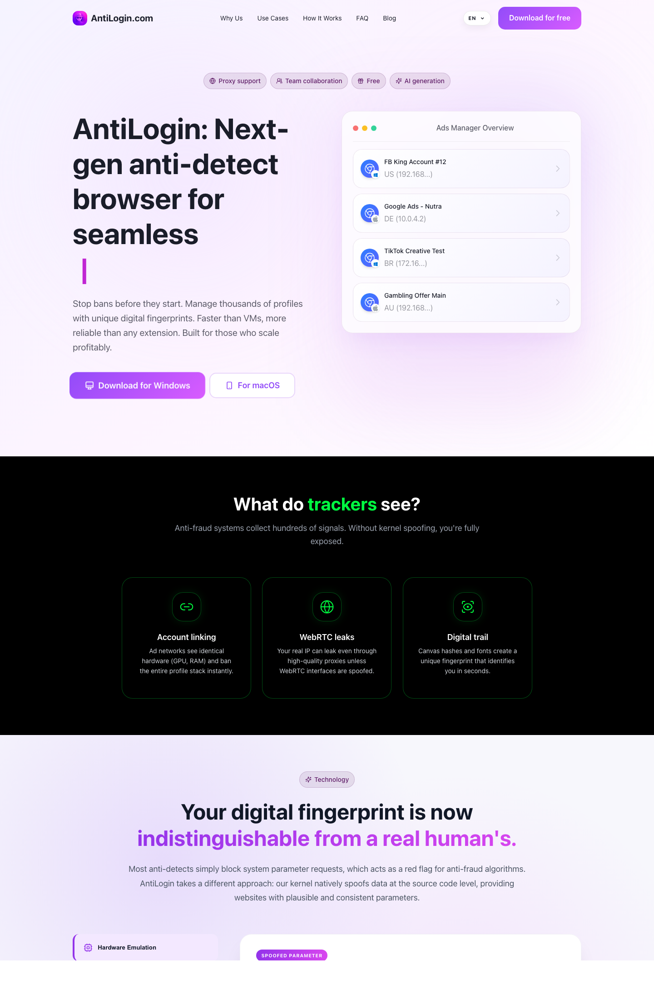

# AntiLogin About

## What
AntiLogin is an antidetect browser platform positioned for affiliate marketing and multi-account operations. The current product communication emphasizes browser-environment consistency, operational scale, and team workflows.

This repository is a public technical overview page for partners, contributors, and users who need one concise reference with product context and canonical links.

## Why
Teams running traffic and account operations need predictable browser fingerprints, proxy control, and collaboration controls with auditability. AntiLogin messaging and internal knowledge-base records describe these as core requirements:
- reducing anti-fraud flags caused by inconsistent browser/device signals;
- scaling profile operations without software-imposed concurrency limits;
- enabling role-based teamwork with controlled access and action history.

## Key Features
- Fingerprint consistency model and anti-detect positioning (knowledge base: FT-003).
- Team collaboration with role model (`Admin`, `Team Lead`, `Farmer`) and action log (FT-002, F-014).
- Proxy stack support: `HTTP`, `SOCKS5`, `SSH`, plus mobile proxy rotation via link-based flow (FT-005, F-010).
- Encryption and profile access control claims: `AES-256` E2E model, zero-knowledge positioning, and profile-password gate for shared launches (FT-006, F-011, F-012).
- Native download distribution for Windows (`.exe`) and macOS Apple Silicon (`.dmg`) builds (F-009, FT-007).
- Built-in Cookie Robot workflow for warm-up/cookie collection in farming scenarios (FT-008, F-015).
- Onboarding offer claim: `14 days free. No feature limits. No card required.` (F-016).

## Links
- Main website: https://antilogin.com/
- Affiliate page (source used for this overview): https://antilogin.com/antidetect-browser-for-affiliate-marketing/
- Windows download: https://download.antilogin.com/AntiLogin-1.5.2.exe
- macOS Apple Silicon download: https://download.antilogin.com/AntiLogin-1.5.2-arm64.dmg
- Telegram: https://t.me/antilogin_browser
- GitHub organization profile: https://github.com/AntiLogin-antidetect-browser/.github
