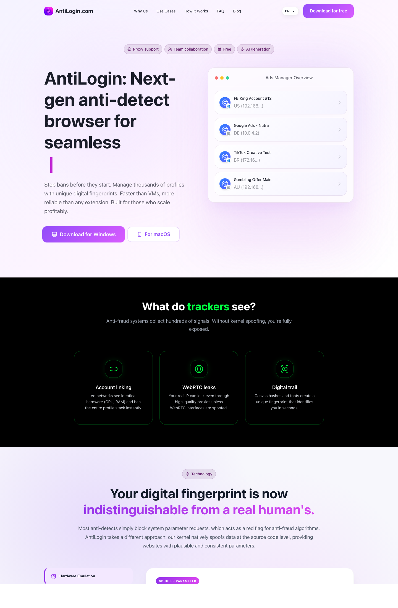

# AntiLogin About

## What
AntiLogin is an antidetect browser platform positioned for affiliate marketing and multi-account operations. The current product communication emphasizes browser-environment consistency, operational scale, and team workflows.

This repository is a public technical overview page for partners, contributors, and users who need one concise reference with product context and canonical links.

## Why
Teams running traffic and account operations need predictable browser fingerprints, proxy control, and collaboration controls with auditability. AntiLogin messaging and internal knowledge-base records describe these as core requirements:
- reducing anti-fraud flags caused by inconsistent browser/device signals;
- scaling profile operations without software-imposed concurrency limits;
- enabling role-based teamwork with controlled access and action history.

## Key Features
- Fingerprint consistency model and anti-detect solution.
- Team collaboration with role model and action log.
- Proxy support: `HTTP`, `SOCKS5`, `SSH`, plus mobile proxy rotation via link-based flow.
- Encryption and profile access control claims: `AES-256` E2E model, zero-knowledge positioning, and profile-password gate for shared launches.
- Built-in Cookie Robot workflow for warm-up/cookie collection in farming scenarios.

## Links
- Main website: https://antilogin.com/
- Affiliate page: https://antilogin.com/antidetect-browser-for-affiliate-marketing/
- Windows & macOS Apple Silicon download: https://antilogin.com
- Telegram: https://t.me/antilogin_browser
